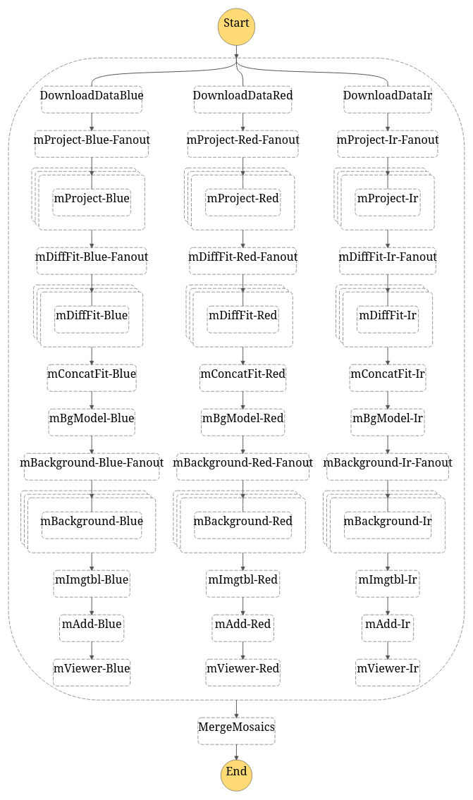
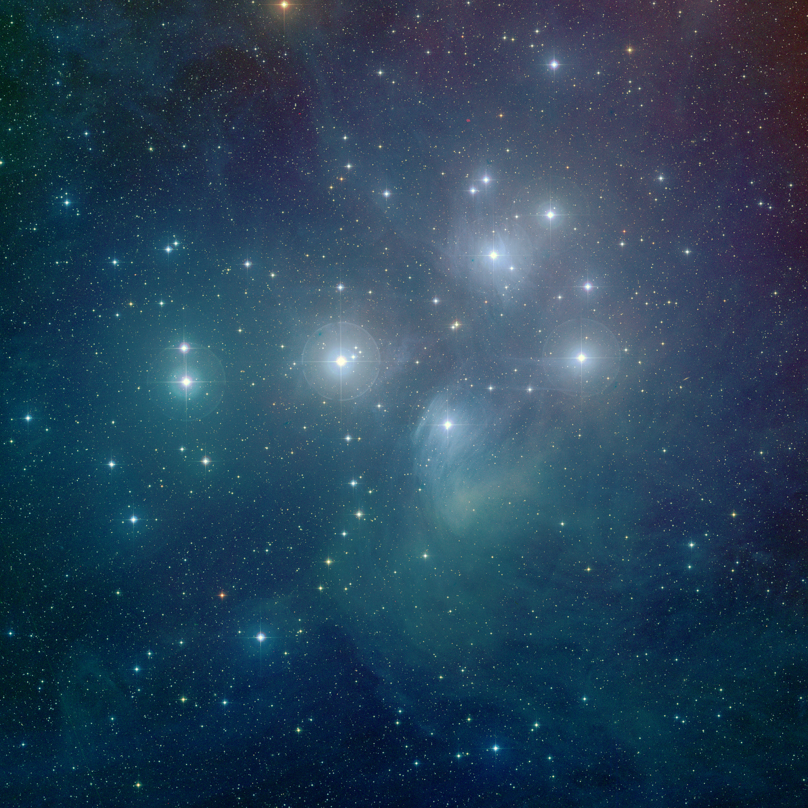

# Montage Workflow

This directory contains an example implementation of the classic Montage Workflow using Amazon Steps Language for the
workflow definition. 



A further explanation of the workflow can be found [here](http://montage.ipac.caltech.edu/docs/grid.html).
We used the example found [here](https://github.com/pegasus-isi/montage-workflow-v2) to produce a color mosaic of the
Pleiades constellation.

To execute the example follow the instructions found [here](../../docs/EXPERIMENTS.md).

```python
import json

from triggerflow.statemachine import StateMachine
from triggerflow.eventsources import KafkaEventSource

with open('montage.json', 'r') as sm_file:
    sm = json.loads(sm_file.read())

kafka_source = KafkaEventSource(broker_list=['192.168.0.1:9092'])

sm = StateMachine.json('montage.json', event_source=kafka_source)
sm.trigger()
```

Result image:
